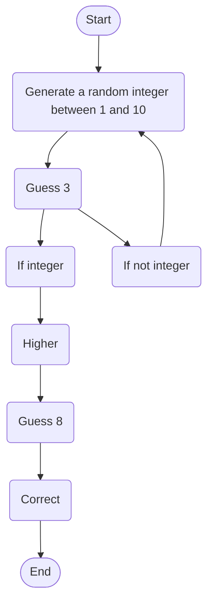

# **Guessing.md**
This is my lab 2 guessing game using mermaid to visually show how it works.

User starts the game then chooses a integer between 1 and 10. The User chooses the integer 3 and the game continues. If the user does not choose a integer then the game will restart. If the users guess was to low the user must choose a higher integer. If the user chooses the correct number then the game ends.
